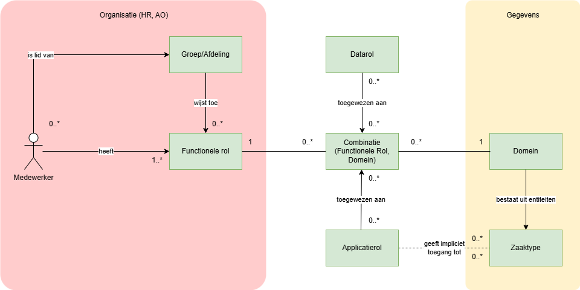

# PodiumD Autorisatie Beheer API

This API provides a **structured authorization model** for fine-grained role-based access (RBAC) to resources involved in Zaakgericht Werken (ZGW). It will serve as a Policy Information Point (PIP) in the context of a Policy Based Access Control (PBAC) architecture.

The model is based on the following information:
- **Functional Roles** are associated to **Domains**, i.e. form pairs.
- **Application Roles** are assigned to pairs of **(Functional Role, Domain)**.
- **Domains** consist of **Entity Types**. In the first use case Entity Types are restricted to Zaaktypes.
- **If a Functional Role has access to a Domain, its Task Roles inherit access to that Domain's Entity Types.**  

The API implements this information model:



Here are links to inspect the API:
- [Redoc](https://redocly.github.io/redoc/?url=https://raw.githubusercontent.com/Hugo-ter-Doest/PABC-API/main/docs/openapi.yaml)
- [Swagger](https://petstore.swagger.io/?url=https://raw.githubusercontent.com/Hugo-ter-Doest/PABC-API/main/docs/openapi.yaml)

# Features
✔ **Manage Functional Roles** (`Create`, `Read`, `Update`, `Delete`)  
✔ **Manage Task Roles** (`Create`, `Read`, `Update`, `Delete`)  
✔ **Assign Task Roles to Functional Roles**  
✔ **Manage Domains & Entity Types** (`Create`, `Read`, `Update`, `Delete`)  
✔ **Assign Entity Types to Domains**  
✔ **Query relationships between roles, domains, and entity types**  

---

# Installation Guide
### **1️⃣ Clone the Repository**
```bash
git clone https://github.com/yourusername/authorization-api.git
cd pabc-api
```
### **2️⃣ Install Dependencies**
```bash
npm install
```

### **3️⃣ Configure Environment Variables**
There are three `.env` files in the root of the project, for testing, development and production. Variables are as follows:

```bash
DB_NAME=auth_db
DB_USER=postgres
DB_PASS=secretpassword
DB_HOST=localhost
PORT=5000
```

`PORT` is the port of the API server.

### **4️⃣ Run PostgreSQL in Docker (Optional)**
To start up Postgres and pgAdmin you can use Docker Compose:
```
docker-compose up -d
```

If you add `--profile api` to the command, it will build the Docker container of the API server and start it.

### **5️⃣ Start the API**
```bash
npm start:dev
```
or
```bash
npm start:prod
```

# API Usage

Overview of available operations:

## CRUD Operations on Base Resources
Functional roles and application roles cannot be manipulated through the API since PABC is not the source of these roles. Functional roles are synchronised with KeyCloak, and application roles with (frontend) applications (like ZAC and KISS).

| **Resource**                      | **Create (C)**                          | **Read (R)**                              | **Update (U)**                          | **Delete (D)**                          |
|------------------------------------|-----------------------------------------|-------------------------------------------|-----------------------------------------|-----------------------------------------|
| **Functional Roles**               | ❌             | `GET /api/functionalRoles`            | ❌          | X       |
| **Domains**                        | `POST /api/domains`                     | `GET /api/domains/:id`                    | `PUT /api/domains/:id`                  | `DELETE /api/domains/:id`               |
| **Entity Types**                   | `POST /api/entityTypes`                 | `GET /api/entityTypes/:id`                | `PUT /api/entityTypes/:id`              | `DELETE /api/entityTypes/:id`           |
| **Application Roles (Task Roles)**  | ❌            | `GET /api/applicationRoles`           | ❌         | X      |
| **Functional Role-Domain Associations** | `POST /api/functionalRoleDomains`       | `GET /api/functionalRoleDomains/:id`      | ❌    | `DELETE /api/functionalRoleDomains/:id` |

## Additional Operations (Assignments & Relationships)

| **Operation**                                         | **Endpoint**                                   | **Description** |
|------------------------------------------------------|-----------------------------------------------|----------------|
| **Assign Application Roles to (FunctionalRole, Domain)** | `POST /api/functionalRoleDomains/:id/applicationRoles` | Assigns Application Roles (Task Roles) to a Functional Role-Domain association. |
| **Get Application Roles for (FunctionalRole, Domain)** | `GET /api/functionalRoleDomains/:id/applicationRoles` | Retrieves all Application Roles assigned to a Functional Role-Domain pair. |
| **Assign Entity Types to a Domain**                  | `POST /api/domains/:id/entityTypes`           | Assigns multiple Entity Types to a Domain (accepts an array of UUIDs). |
| **Get Entity Types for a Domain**                    | `GET /api/domains/:id/entityTypes`            | Retrieves all Entity Types assigned to a Domain. |
| **Remove All Entity Types from a Domain**            | `DELETE /api/domains/:id/entityTypes`         | Removes all Entity Types assigned to a Domain. |
| **Get Application Roles per Entity Type**                                | `POST /api/getApplicationRolesPerEntityType`            | Returns a mapping of entity types to application roles |
| **Get Entity Types per Application Role**                                | `POST /api/getEntityTypesPerApplicationRole`            | Returns a mapping of application roles to entity types |

The last two operations in the table are the main calls for clients like ZAC and KISS, or their PDP if you decide to delegate that. The input for the call is a list of functional roles and the output is a mapping of either application roles to entity types or entity types to application roles.

```bash
curl -X POST http://localhost:5000/api/access/getEntityTypesPerApplicationRole \
     -H "Content-Type: application/json" \
     -d '{
           "functionalRoleNames": ["Medewerker Vergunningen"]
         }'
```

```json
[
  {
    "applicationRole": {
        "name": "Zaak behandelen"
    },
    "entityTypes": [
      {
        "id": "1b72e021-e186-40be-8c26-0ab92b610393",
        "type": "zaaktype",	
        "uri": "uri to a zaaktype in OpenZaak"
      },
      {
        "id": "e408fac5-bf0f-45b7-b3b1-f23576ceec53",
        "type": "zaaktype",	
        "uri": "uri to a zaaktype in OpenZaak"
      }
    ]
  },
  {
    "applicationRole": {
      "name": "Zaak lezen"
    },
    "entityTypes": [
      ...
    ]
  }
]
```	

# Running Tests
To run the tests, navigate to the root directory of the repository and run the following command:

```bash
npm run test
```
Tested Features: 
- CRUD operations for Functional Roles, Task Roles, Domains, Entity Types
- Associating Functional Roles with Domains
- Assigning Application Roles to (Functional Role, Domain) pairs
- Assigning Entity Types to Domains
- Querying relationships between entities

# Developing
For development you can run the development server:

```bash
npm run start:dev
```

It starts the server with `nodemon` which restarts the server with every code change.

# Production
For production the server is started as follows:

```bash
npm run start:prod
```

Alternatively, there is a Dockerfile included to create a Docker image.

# License
This project is licensed under the EUPL 1.2 License. Feel free to use and modify it! 🚀
